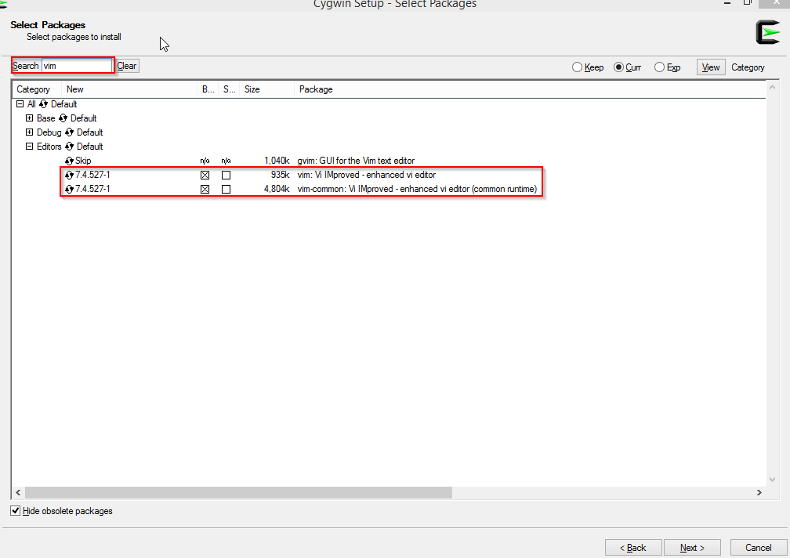
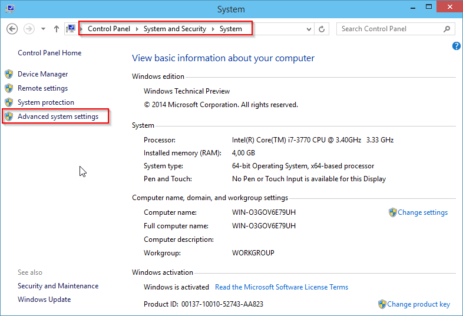
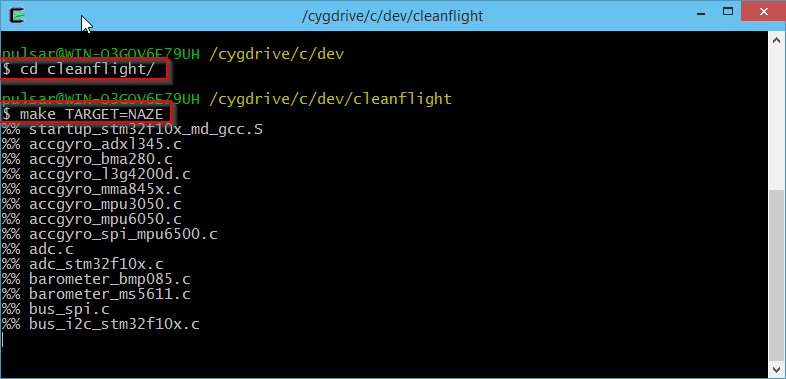

# Building in windows


## Bash On Windows 10

A new feature in Windows 10 allows any developer to quickly and easily run an entire linux subsystem in windows and access it via a bash terminal. This gives developers full use of the entire linux OS and all of the great existing linux tools and programs. When Bash for Windows is up and running it feels like you sshed into a full linux box, except the linux distro is actually running alongside windows locally.

If you use Bash on Windows you can easily build u360gts exactly as you would for Ubuntu. (the linux distro running on Windows is Ubuntu Trusty)

Setup for Bash on Windows is very easy and takes less than 5 minutes. [For instructions follow the official guide here.](https://msdn.microsoft.com/commandline/wsl/install_guide)

Once you have Bash On Windows running you can follow the "Building in Ubuntu" instructions for building cleanfight.

##Setup Cygwin

download the Setup*.exe from https://www.cygwin.com/


Execute the download Setup and step through the installation  wizard (no need to customize the settings here). Stop at the  "Select Packages" Screen and select the following Packages
for Installation:

- Devel/git
- Devel/bash-completion (was git-completion, Optional)
- Devel/make
- Devel/binutils
- Editors/vim	 
- Editors/vim-common (Optional)
- Shells/mintty (should be already selected)





Continue with the Installation and accept all autodetected dependencies.


##Setup GNU ARM Toolchain

----------

versions do matter, 5.4 is known to work well. Download this version from https://launchpad.net/gcc-arm-embedded/5.0/5-2016-q2-update/+download/gcc-arm-none-eabi-5_4-2016q2-20160622-win32.zip 


Extract the contents of this archive to any folder of your choice, for instance ```C:\dev\gcc-arm```. 


add the "bin" subdirectory to the PATH Windows environment variable: ```%PATH%;C:\dev\gcc-arm\bin```




## Checkout and compile u360gts

Head over to the u360gts Github page and grab the URL of the GIT Repository: "https://github.com/u360gts/u360gts.git"

Open the Cygwin-Terminal, navigate to your development folder and use the git commandline to checkout the repository:

```bash
cd /cygdrive/c/dev
git clone https://github.com/u360gts/u360gts.git
```


To compile your u360gts binaries, enter the u360gts directory and build the project using the make command. You can append TARGET=[HARDWARE] if you want to build anything other than the default NAZE target:

```bash
cd u360gts
make TARGET=NAZE
```



within few moments you should have your binary ready:

```bash
(...)
arm-none-eabi-size ./obj/main/u360gts_NAZE.elf
   text    data     bss     dec     hex filename
  95388     308   10980  106676   1a0b4 ./obj/main/u360gts_NAZE.elf
arm-none-eabi-objcopy -O ihex --set-start 0x8000000 obj/main/u360gts_NAZE.elf obj/u360gts_NAZE.hex
```

You can use the u360gts-Configurator to flash the ```obj/u360gts_NAZE.hex``` file.

## Updating and rebuilding

Navigate to the local u360gts repository and use the following steps to pull the latest changes and rebuild your version of u360gts:

```bash
cd /cygdrive/c/dev/u360gts
git reset --hard
git pull
make clean TARGET=NAZE -j16 -l
make
```

You may want to remove -j16 -l if your having a hard time narrowing down errors.  It does multithreaded make, however it makes it harder to know which warning or error comes from which file.

